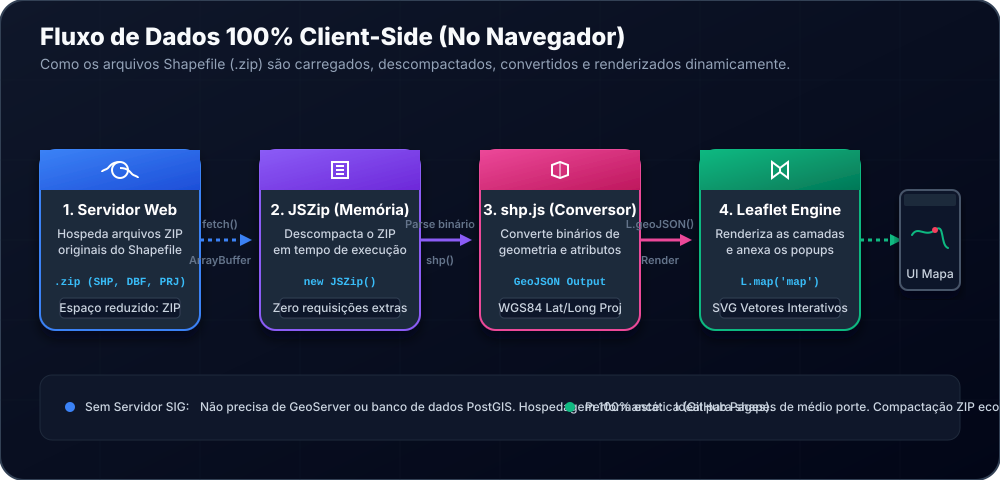
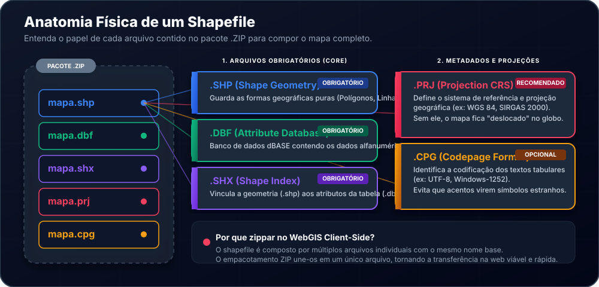

# 🗺️ Mapas Interativos & WebGIS Client-Side

> **Construção e Renderização Dinâmica de Shapefiles diretamente no Navegador com Leaflet.js, JSZip e shp.js**

---

<p align="center">
  
  
  
  
  
</p>

---

## ⚓ Menu de Navegação Rápida (Pontos de Interesse)

* [📌 1. Sobre o Projeto](#-1-sobre-o-projeto)
* [⚙️ 2. Arquitetura Client-Side (No Navegador)](#%EF%B8%8F-2-arquitetura-client-side-no-navegador)
* [🧬 3. Anatomia Física de um Shapefile](#-3-anatomia-física-de-um-shapefile)
* [🛠️ 4. Tecnologias & Bibliotecas](#%EF%B8%8F-4-tecnologias--bibliotecas)
* [🧑‍💻 5. Análise Técnica do Código Fonte](#-5-análise-técnica-do-código-fonte)
* [📈 6. Desafios, Limitações e Práticas de Otimização](#-6-desafios-limitações-e-práticas-de-otimização)
* [🚀 7. Como Executar o Projeto Localmente](#-7-como-executar-o-projeto-localmente)
* [📄 8. Licença](#-8-licença)

---

## 📌 1. Sobre o Projeto

Este projeto é uma aplicação de **WebGIS (Sistemas de Informação Geográfica na Web)** interativa e dinâmica que demonstra o poder de renderização vetorial no lado do cliente. O mapa apresenta dados críticos de **gestão ambiental e governança regional** do estado de São Paulo, exibindo simultaneamente duas camadas de alta relevância técnica:

1. **Áreas Contaminadas (CETESB 2020)**: Mapeamento detalhado de regiões monitoradas devido à presença de contaminantes químicos ou industriais. A ferramenta expõe a razão social do estabelecimento, atividade econômica operante, localização física precisa e o status atual da classificação da área.
2. **Divisão de Municípios de SP (IBGE 2024)**: Limites geográficos e dados espaciais detalhados de todos os municípios paulistas, incluindo o código de área total calculada em quilômetros quadrados ($km^2$).

### A Importância Prática
* **Gestão Ambiental**: Facilita o mapeamento visual rápido e cruzamento de informações sobre riscos ecológicos e proximidade a bacias urbanas.
* **Planejamento de Solo Urbano**: Fornece a construtores, técnicos ambientais e gestores públicos uma visão instantânea da classificação de restrição de uso de terras (ex: áreas reabilitadas vs áreas em processo de remediação).

---

## ⚙️ 2. Arquitetura Client-Side (No Navegador)

A grande maioria das aplicações de mapas na web que consomem arquivos pesados de SIG (como Shapefiles) depende de uma infraestrutura robusta de servidor (como um banco **PostgreSQL/PostGIS** integrado a um servidor de mapas como **GeoServer** ou **MapServer** para expor serviços do tipo *WMS* ou *WFS*).

Este projeto utiliza uma **arquitetura alternativa inovadora de processamento 100% dinâmico no lado do cliente (Client-Side)**. O navegador do usuário é o único encarregado de descompactar o arquivo `.zip` original, fazer o parse binário de dados espaciais e renderizá-los na tela.

### Fluxo de Processamento de Dados

A imagem abaixo ilustra a jornada completa de processamento do mapa, desde a requisição HTTP inicial até a montagem final de elementos interativos na tela:



### Vantagens dessa Abordagem
* **Hospedagem Estática Sem Custos**: A aplicação inteira pode ser hospedada gratuitamente em servidores de arquivos estáticos como o **GitHub Pages**, sem a necessidade de manter serviços ativos de bancos de dados ou servidores SIG pesados.
* **Economia Extrema de Banda (Rede)**: Como os dados originais são transmitidos em um pacote ZIP compactado, o volume de tráfego de rede cai drasticamente em comparação com o envio de arquivos GeoJSON brutos (que são arquivos de texto puro e ocupam muito mais espaço).
* **Interatividade Latente**: Uma vez carregados na memória do navegador, os cliques, efeitos de hover e filtragens ocorrem instantaneamente, sem gerar latência ou novas requisições HTTP para o servidor.

---

## 🧬 3. Anatomia Física de um Shapefile

O **Shapefile** é um formato de armazenamento de dados espaciais desenvolvido pela ESRI na década de 1990 que se tornou o padrão de fato da indústria de geoprocessamento. Embora falemos dele no singular, um "Shapefile" é, na verdade, um conjunto de vários arquivos que compartilham o mesmo nome, diferenciando-se pelas suas extensões.

Para carregar dados com sucesso em nosso WebGIS, o pacote `.zip` precisa conter pelo menos as extensões obrigatórias, como detalhado no diagrama abaixo:



### Detalhamento dos Componentes

* **`.SHP` (Shape Geometry) - *Obrigatório***: Contém as informações estritamente geométricas do mapa. São sequências complexas de coordenadas binárias de pontos ($X, Y$), linhas ou polígonos que desenham as fronteiras.
* **`.DBF` (Attribute Database) - *Obrigatório***: Banco de dados no formato antigo dBASE IV. Guarda uma estrutura de tabela associada às feições espaciais, armazenando os nomes de ruas, códigos, atividades industriais ou dados quantitativos. Cada linha na tabela do `.dbf` corresponde a um vetor físico no arquivo `.shp`.
* **`.SHX` (Shape Index) - *Obrigatório***: Arquivo de índice posicional de geometria. Ele indica onde cada registro geométrico do `.shp` começa dentro do arquivo binário, permitindo que a aplicação faça buscas de feições específicas de forma rápida na memória (acesso randômico), sem ler todo o arquivo linearmente.
* **`.PRJ` (Projection Format) - *Recomendado***: Um arquivo de texto contendo a definição do **Sistema de Referência de Coordenadas (CRS)** no padrão *WKT (Well-Known Text)*. O `.prj` informa se os dados utilizam graus decimais (como o sistema global WGS 84) ou metros cartesianos planares (como a projeção UTM). **Sem ele, o mapa do Leaflet não saberia em qual lugar do globo terrestre as geometrias devem ser posicionadas**.
* **`.CPG` (Codepage) - *Opcional***: Um arquivo simples que informa qual é o mapa de caracteres do banco dBASE (ex: `UTF-8` ou `ISO-8859-1`). Garante que as palavras acentuadas da língua portuguesa (ex: "Áreas Contaminadas", "Municípios") sejam mostradas de forma correta, evitando caracteres truncados (como `` ou `é`).

---

## 🛠️ 4. Tecnologias & Bibliotecas

O sucesso do processamento em tempo real no navegador se deve à combinação de três ferramentas fundamentais:

* **[Leaflet.js](https://leafletjs.com/) (v1.9.4)**: Uma das bibliotecas JavaScript open-source mais populares do mundo para criação de mapas interativos em dispositivos móveis e desktop. É extremamente leve, tem excelente suporte a interações por toque e renderiza geometrias diretamente em elementos SVG/Canvas do navegador.
* **[JSZip](https://stuk.github.io/jszip/) (v3.10.1)**: Biblioteca JavaScript de alto desempenho capaz de ler, criar, descompactar e modificar arquivos `.zip` em memória diretamente no navegador do usuário, usando buffers binários (`ArrayBuffer`).
* **[shpjs](https://github.com/calvinmetcalf/shapefile-js) (Latest)**: Um parse avançado escrito em JavaScript que lê os fluxos de bytes puros do Shapefile descompactado pelo JSZip e reconstrói as coordenadas geográficas em um objeto **GeoJSON** estruturado, permitindo que o Leaflet consuma os dados diretamente.

---

## 🧑‍💻 5. Análise Técnica do Código Fonte

Abaixo, detalhamos os trechos mais importantes da lógica aplicada em [mapa.js](file:///d:/99.projeto/MapasInterativos/mapa.js) para que você compreenda e domine o funcionamento do fluxo de geoprocessamento.

### 5.1. Inicialização do Mapa Base

```javascript
// Define a visualização padrão inicial centrada em São Paulo, com zoom nível 8
const map = L.map('map').setView([-23.55, -46.63], 8); 

// Adiciona o mapa base do OpenStreetMap (telas / tiles de fundo)
L.tileLayer('https://{s}.tile.openstreetmap.org/{z}/{x}/{y}.png', {
  attribution: '&copy; OpenStreetMap contributors'
}).addTo(map);

// Cria o controle flutuante de camadas liga/desliga no topo direito
const overlayMaps = {};
const layersControl = L.control.layers(null, overlayMaps).addTo(map);
```

### 5.2. O Pipeline de Carregamento e Parsing

A função `addShapefileLayer` condensa o processamento binário utilizando Promises assíncronas em JavaScript:

```javascript
function addShapefileLayer(name, url, styleOptions, camposDesejados) {
  fetch(url) // 1. Faz o download do pacote ZIP de forma assíncrona
    .then(res => res.arrayBuffer()) // 2. Converte a resposta em dados binários brutos (ArrayBuffer)
    .then(buffer => shp(buffer)) // 3. O shp.js intercepta e extrai o ZIP gerando um objeto GeoJSON
    .then(geojson => {
      // 4. Instancia a camada Leaflet a partir do GeoJSON processado
      const layer = L.geoJSON(geojson, {
        style: styleOptions, // Aplica cores, espessuras e opacidade customizadas
        onEachFeature: function (feature, lyr) {
          const props = feature.properties;
          let popupContent = "<h4>Detalhes</h4>";
          
          // 5. Filtra e anexa os metadados tabulares ao Popup interativo
          camposDesejados.forEach(key => {
            if (props[key]) {
              popupContent += `<b>${key}</b>: ${props[key]}<br>`;
            }
          });

          lyr.bindPopup(popupContent || "Sem informações disponíveis.");
        }
      });

      // 6. Registra a camada no controle interativo de ligar/desligar
      overlayMaps[name] = layer;
      layer.addTo(map);
      layersControl.addOverlay(layer, name);

      // 7. Auto-ajuste de câmera (Zoom Inteligente) baseado nos limites geográficos reais
      const bounds = layer.getBounds();
      if (bounds.isValid()) {
        allBounds.push(bounds);
        const combined = allBounds.reduce((a, b) => a.extend(b));
        map.fitBounds(combined); // Enquadra o mapa perfeitamente para exibir todas as feições carregadas
      }
    })
    .catch(err => console.error(`Erro ao carregar ${url}:`, err));
}
```

### 5.3. Chamadas de Consumo de Dados Estáticos

Com a lógica estruturada, basta instanciarmos cada camada passando seu caminho relativo, estilos visuais e as colunas de atributos textuais que desejamos exibir ao usuário:

```javascript
// Chamada das Áreas Contaminadas (CETESB) - Cores em Azul
addShapefileLayer('Áreas Contaminadas CETESB', 'assets/mapas/AREA_CONTAMINADA_CETESB_2020.zip', {
  color: 'blue',
  weight: 2,
  fillOpacity: 0.4
}, ["Razao_soci", "Endereco", "Numero", "Atividade", "Classifica"]);

// Chamada dos Limites dos Municípios (IBGE) - Cores em Verde
addShapefileLayer('Municípios de SP', 'assets/mapas/SP_Municipios_2024.zip', {
  color: 'green',
  weight: 1,
  fillOpacity: 0.1
}, ["NM_MUN", "SIGLA_UF", "AREA_KM2"]);
```

---

## 📈 6. Desafios, Limitações e Práticas de Otimização

Embora a arquitetura *client-side* seja formidável para agilidade de desenvolvimento e economia de infraestrutura, existem fatores importantes que um engenheiro de software/GIS deve considerar ao utilizá-la em projetos de produção de larga escala:

### ⚠️ Principais Desafios

1. **Gargalo de Banda (Download de Arquivos)**:
   * O arquivo `SP_Municipios_2024.zip` tem cerca de **10.5 MB**. Para conexões 3G/4G instáveis ou dispositivos móveis antigos, o download de 10 MB antes da primeira exibição do mapa pode gerar uma experiência de carregamento demorada.
2. **Uso de Memória RAM e Processador (CPU)**:
   * O JavaScript roda em uma única thread principal (Single-Thread) no navegador. Fazer a descompactação ZIP e converter milhares de coordenadas de ponto flutuante na memória RAM pode fazer a interface web engasgar brevemente durante o carregamento de bases massivas de dados (como todos os bairros do Brasil).

### 💡 Práticas Recomendadas para Alta Otimização

Se você deseja evoluir esse projeto para níveis comerciais com bases de dados gigantescas, adote as seguintes práticas recomendadas:

* **Simplificação Geométrica (Douglas-Peucker)**:
  * Utilize ferramentas como o **[Mapshaper](https://mapshaper.org/)** ou o software **QGIS** antes de exportar o shapefile. A remoção de curvas de altíssima fidelidade irrelevantes em zooms distantes pode reduzir o tamanho dos arquivos em até **90%** sem alterar a percepção visual das fronteiras do município.
* **Migração para PMTiles ou Vector Tiles**:
  * Em vez de ler todo o arquivo de uma só vez, você pode converter o Shapefile em arquivos de blocos de vetores (**Vector Tiles** como `.pbf` ou o formato moderno de arquivo único **PMTiles**). Desta forma, o Leaflet fará o download exclusivo das feições correspondentes ao pedaço específico de tela que o usuário está visualizando no momento do zoom, diminuindo o consumo de rede de megabytes para poucos kilobytes.
* **Seleção Estrita de Atributos**:
  * Ao exportar o arquivo `.dbf` no GIS, apague todas as colunas de dados tabulares não utilizadas na aplicação web. Isso economiza valiosos bytes de download.

---

## 🚀 7. Como Executar o Projeto Localmente

Por questões de segurança nativa do navegador (conhecida como **política CORS - Cross-Origin Resource Sharing**), você **não pode** abrir o arquivo `index.html` diretamente dando dois cliques no Windows Explorer (utilizando o protocolo `file:///`). Fazer isso bloqueará o carregamento dos pacotes ZIP por restrição do método `fetch()`.

É obrigatório iniciar um servidor local simples. Abaixo estão as formas mais rápidas de fazer isso:

### Opção A: Utilizando o VS Code (Mais Fácil)
1. Instale a extensão chamada **Live Server**.
2. Diga ao VS Code para abrir a pasta principal do projeto.
3. No canto inferior direito da barra do editor, clique em **Go Live**.
4. Seu navegador abrirá automaticamente em `http://127.0.0.1:5500`.

### Opção B: Utilizando Python (Sem Instalações Extras)
Se você já possui Python instalado no computador, abra o PowerShell ou Prompt de Comando na pasta do projeto e execute:

```bash
# Para Python 3.x
python -m http.server 8000
```
Depois abra o navegador e acesse: [http://localhost:8000](http://localhost:8000)

### Opção C: Utilizando Node.js (via Terminal)
Se você utiliza Node.js, você pode instalar e rodar instantaneamente o pacote `http-server`:

```bash
npx http-server ./
```
Acesse a URL gerada no terminal (geralmente `http://127.0.0.1:8080`).

---

## 📄 8. Licença

Este projeto está licenciado sob a licença MIT - consulte o arquivo [LICENSE](file:///d:/99.projeto/MapasInterativos/LICENSE) para obter mais detalhes.

---

<p align="center">
  Desenvolvido com 💚 para propagar conhecimento em engenharia de dados, cartografia digital e computação web.
</p>
